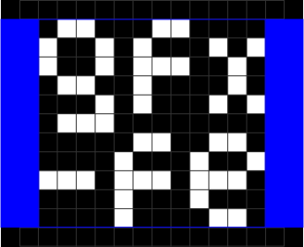

  <picture>
      <source media="(prefers-color-scheme: dark)" srcset="./.github/logo-dark.svg">
      
  </picture>

# gfx-fe

A web-based GFX Font Editor for [Adafruit GFX Fonts](https://learn.adafruit.com/adafruit-gfx-graphics-library/using-fonts)

Try it live: [arnoson.github.io/gfx-fe](https://arnoson.github.io/gfx-fe/)

## Demo

https://github.com/user-attachments/assets/217e08ad-82e5-4268-96f3-4cb33ff1679a

## Documentation

### Add new Glyphs

Select the `+` icon in the `Glyphs` section. You can use multiple characters separated by spaces `A B C`, unicode notation `\u003F` and ranges `a-z 0-9 \u0041-\u005A` to add one or more glyphs.

### Tools

#### Pen/Eraser

A simple pixel-drawing pen. If you start drawing on an empty spot on the canvas, it acts as a pen, if you start drawing on an existing pixel, it acts as an eraser.

#### Select

A free-hand select tool to move, copy or cut pixels.

#### Fill

Automatically fill in the pixels based on the selected font. For this to work, you have to choose a font in the `Based on` section in the left sidebar first. Note: this will clear all existing pixels of the glyph before filling it. It will also set the [bearings](#bearings).

### Bearings

Adjust the left and right side bearings of the glyph.

### Guides

With the `Metrics` fields in the left sidebar you can add visual guides for ascender, cap-height, x-height and descender. These guides are relative to the baseline, which can also be adjusted in the left sidebar.

### Canvas

The canvas dimensions can be adjusted in the left sidebar. While you are editing the font, the canvas is non-destructive, meaning you don't lose any cropped pixels. But as soon as you save the font, the glyphs get cropped.

### Based on

Use an existing font installed on your computer as the basis for your pixel font. Select any of your installed fonts (only available in Chromium-based browser) or enter the font name directly. The threshold determines how the glyphs are auto-filled, see [Fill Tool](#fill). To see its effect fill in a glyph and adjust if necessary.

### Preview

Multi-line preview of your font. With multi-line text this is especially useful for adjusting the canvas height, baseline and leading.
